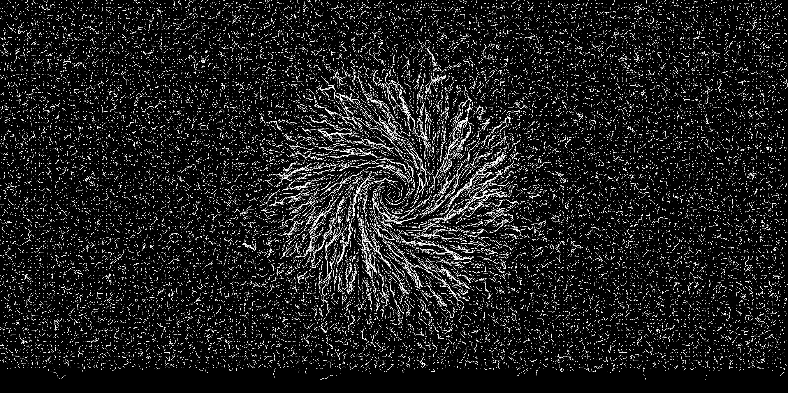

# flow-simulator

generates a bunch of particles randomly distributed on a plane
a velocity field is applied, moving the particles along a burgers vortex

see params in `main.c`

# use

download libtiff
 - option 1:
   - edit Makefile to include libtiff to your custom director
 - option 2:
   - `make install` libtiff

call `run.sh` under the `src` directory
